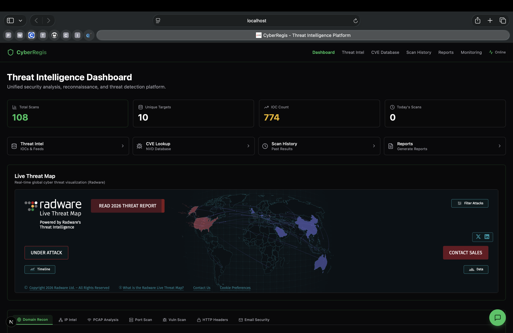
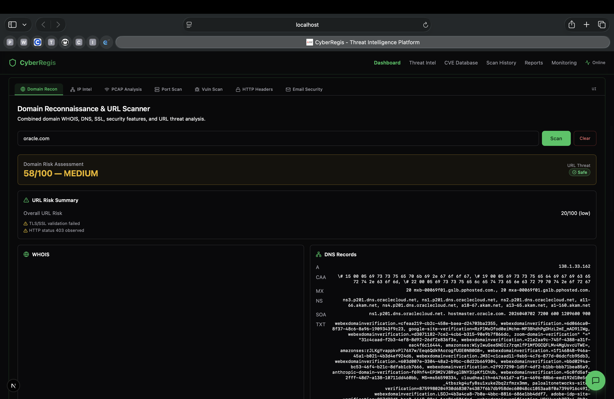
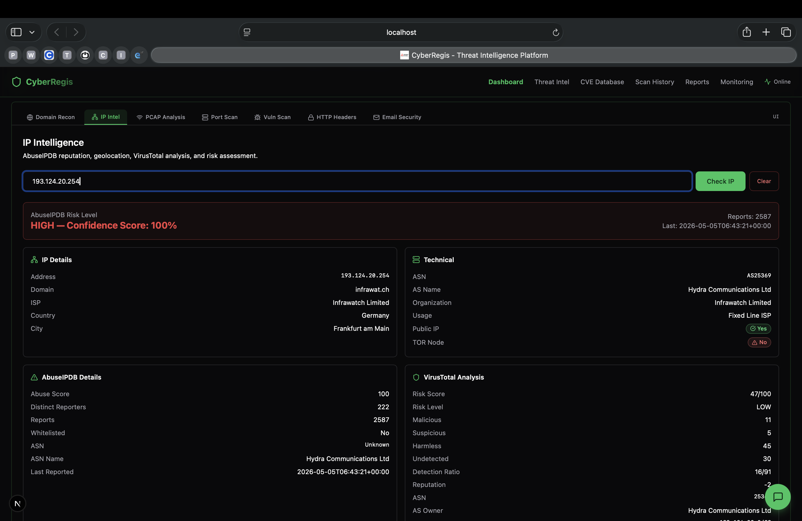
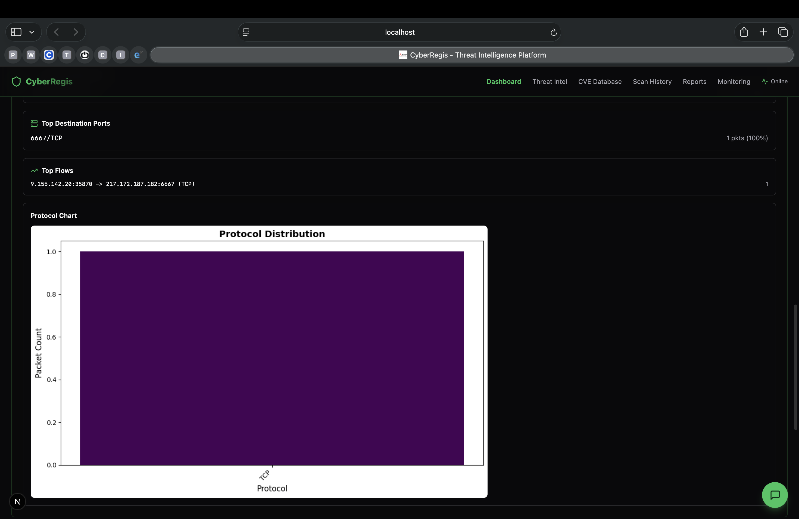
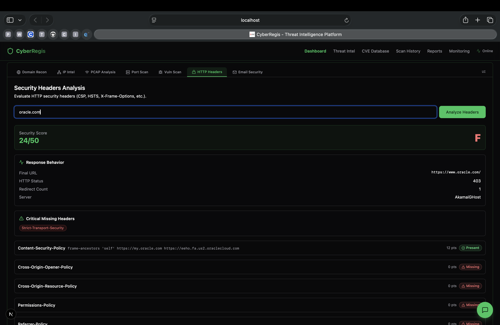

# CyberRegis Client

Analyst console for [CyberRegis Server](https://github.com/Kathan2004/CyberRegis_Server). One dark-mode dashboard for domain recon, IP intel, PCAP analysis, port and vulnerability scans, HTTP header and email-auth grading, IOC tracking, CVE lookup, scheduled monitoring and report generation.



## Features

| Page | What it does |
|---|---|
| Dashboard | Scan and IOC counters, live threat map, and a tabbed workspace for Domain Recon, IP Intel, PCAP Analysis, Port Scan, Vuln Scan, HTTP Headers and Email Security. Includes an AI analyst chat. |
| Threat Intel | IOC store, threat feed ingestion and insights, ATT&CK tactic and technique browser |
| CVE Database | NVD search and CVE detail view |
| Scan History | Every stored scan with its full result |
| Reports | Exportable security reports per target |
| Monitoring | Scheduled recurring scans with cached results |
| Resources | Curated tooling, trending security repos and threat news |

## Architecture

```
browser ──► Next.js (project2) ──► /api/backend/[...path]  (server-side proxy, adds API token)
                                         │
                                         └──► CyberRegis Server (Flask) /api/*
```

The browser never talks to Flask directly. The proxy route reads `CYBERREGIS_API_TOKEN` on the server, so the token is never shipped to the client. It only forwards `/api/*` paths and never forwards cookies.

## Run it

Start [CyberRegis Server](https://github.com/Kathan2004/CyberRegis_Server) with an `API_TOKEN` first, then:

```bash
git clone https://github.com/Kathan2004/CyberRegis-Client.git
cd CyberRegis-Client/project2
cp .env.example .env.local       # set CYBERREGIS_BACKEND_URL and CYBERREGIS_API_TOKEN
npm ci
npm run dev                      # http://localhost:3000
```

Production build: `npm run build && npm start`.

The console has no user login of its own. Run it on localhost or put it behind your own auth (reverse-proxy basic auth, SSO, VPN). Anyone who can reach it can drive the backend.

## Stack

Next.js 16 (App Router), React 19, TypeScript, Tailwind CSS, shadcn/ui (Radix), Recharts, lucide-react.

## Repository layout

```
project2/            Next.js application
  app/               routes (dashboard, threat-intel, cve, history, reports, monitoring, resources)
  app/api/backend/   server-side proxy to the Flask API
  app/api/news/      RSS aggregation for threat news
  app/lib/           typed API client
  components/        UI components (shadcn/ui)
docs/                feature notes, project report, screenshots
```

## Screenshots

| | |
|---|---|
|  |  |
|  |  |

## Security

See [SECURITY.md](SECURITY.md). Only scan assets you own or are authorised to test.
